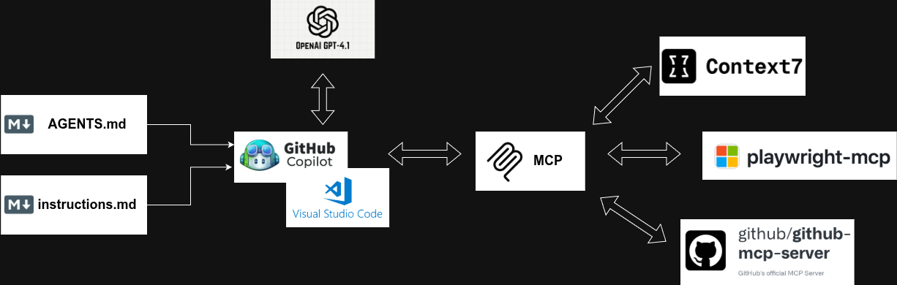

# 🧑‍💻 AI Development Tooling for *Toxic Turtle*

**Full-Stack Developer Perspective**

To build *Toxic Turtle* efficiently and with high code quality, I rely on a **modern AI-assisted development stack**. This setup allows me to move fast, keep consistency across frontend and backend, and design an educational game aligned with KTurtle concepts.

Below is a clear explanation of the **AI dev tools, environment, and workflow** I use.

---

## 🖥️ Development Environment: VS Code

All development happens inside **Visual Studio Code (VS Code)**, which acts as the central hub for:

* Frontend development (game UI, canvas, animations)
* Backend services (game logic, validation, storage)
* AI-assisted coding via LLMs
* MCP (Model Context Protocol) integrations

VS Code is ideal because it supports:

* Extensions
* AI copilots
* Custom instruction files
* MCP servers
* GitHub integration

---

## 🤖 LLM Choice: ChatGPT 4.1

The primary **Large Language Model** used during development is:

### **ChatGPT 4.1**

I use ChatGPT 4.1 as:

* 🧠 A **pair programmer**
* 📐 A **system designer**
* 🧪 A **test generator**
* 📘 A **documentation assistant**

**Why ChatGPT 4.1?**

* Strong reasoning for game logic and algorithms
* Clear explanations for educational content
* Reliable code generation for frontend and backend
* Good balance between creativity and correctness

---

## 🔌 MCP (Model Context Protocol) Stack

To give the LLM **real project awareness**, I use the **MCP protocol**.
MCP allows AI models to securely access tools, repositories, and contextual information.

### Installed MCP Tools

#### 1️⃣ Context7

* Provides **long-term structured context**
* Helps the model understand:

  * Game design rules
  * KTurtle syntax constraints
  * Educational goals
* Prevents repetitive explanations and hallucinations

📌 Example usage:

* “Remember that commands must stay KTurtle-compatible”
* “This game targets children aged 7–11”

---

#### 2️⃣ Microsoft Playground

* Used to:

  * Experiment with prompts
  * Test LLM behaviors
  * Tune instruction styles
* Acts as a **sandbox** before applying changes to the real codebase

This reduces trial-and-error directly in production files.

---

#### 3️⃣ GitHub MCP

* Connects the LLM directly to:

  * Repositories
  * Pull requests
  * Issues
  * Code history

With GitHub MCP, the model can:

* Understand project structure
* Follow existing patterns
* Generate code aligned with repository standards

This is crucial for maintaining consistency in a growing codebase.

---

## 📄 Instruction-Driven Development

To control how the LLM behaves, I use **explicit instruction files** inside the repository.

---

### 📘 `AGENTS.md`

This file defines **roles and responsibilities** for AI agents.

Example contents:

* Frontend agent: focuses on UI, UX, accessibility
* Backend agent: focuses on APIs, logic, validation
* Education agent: ensures content is child-friendly and pedagogical
* Game design agent: ensures mechanics support learning goals

This allows me to:

* Assign **clear mental models** to the LLM
* Avoid mixed or contradictory outputs
* Scale development with multiple AI roles

---

### ⚙️ `copilot-instruction.md`

This file contains **low-level behavioral instructions** for the LLM, such as:

* Coding style rules
* Naming conventions
* Framework preferences
* KTurtle syntax limitations
* Error-handling tone (friendly for children)

Example rules:

* “Always generate readable code with comments”
* “Avoid advanced syntax not suitable for beginners”
* “All error messages must be child-friendly”

This ensures **consistency across all generated code**.

---

## 🔁 Development Workflow

1. 🧠 Define task or feature in natural language
2. 📄 Update or reference `AGENTS.md` and `copilot-instruction.md`
3. 🤖 Use ChatGPT 4.1 inside VS Code
4. 🔌 MCP tools provide:

   * Repository context
   * Design constraints
   * Educational goals
5. 🧪 Validate output manually and with tests
6. 🔄 Iterate quickly with AI feedback

---

## ✅ Benefits of This Setup

* 🚀 Faster development
* 📚 Pedagogically correct game logic
* 🧩 Consistent architecture
* 🧒 Child-friendly UX and language
* 🔒 Controlled and predictable LLM behavior

---

## 🏁 Conclusion

By combining **VS Code**, **ChatGPT 4.1**, **MCP tools**, and **instruction-driven development**, I create a powerful AI-assisted workflow that enables me to build *Toxic Turtle* as:

* A **real game**
* A **serious educational tool**
* A **scalable, maintainable software project**

